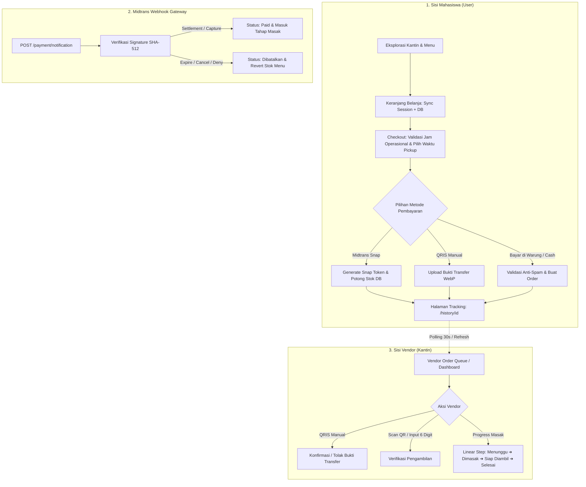
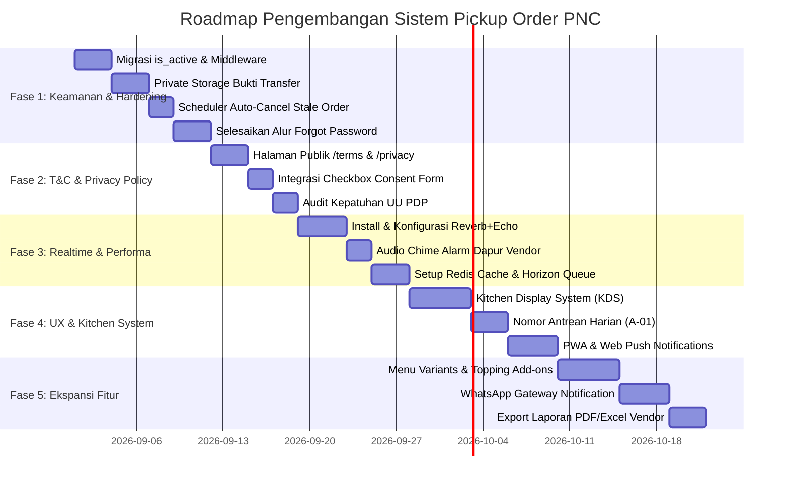

# MASTER PLANNING & ROADMAP PENGEMBANGAN
# SISTEM PICKUP ORDER POLITEKNIK NEGERI CILACAP (PNC)

> **Versi Dokumen:** 1.0.0  
> **Tanggal Pembuatan:** 25 Agustus 2026  
> **Target Platform:** Web (Desktop & Mobile Responsive) / PWA Ready  
> **Stack Utama:** Laravel 13, Blade Components, Tailwind CSS v4, DaisyUI 5, Alpine.js 3, MySQL/Redis, Cloudflare R2 (Object Storage & CDN), Midtrans SDK, Resend.

---

## 📑 DAFTAR ISI
1. [Ringkasan Eksekutif & Ruang Lingkup](#1-ringkasan-eksekutif--ruang-lingkup)
2. [Hasil Tracing Arsitektur & Alur Data Saat Ini](#2-hasil-tracing-arsitektur--alur-data-saat-ini)
3. [Rencana Perbaikan Keamanan & Hardening (Security Plan)](#3-rencana-perbaikan-keamanan--hardening-security-plan)
4. [Spesifikasi & Rencana Integrasi T&C serta Kebijakan Privasi (UU PDP)](#4-spesifikasi--rencana-integrasi-tc-serta-kebijakan-privasi-uu-pdp)
5. [Optimasi Performa & Penambahan Stack (Performance & Stack Plan)](#5-optimasi-performa--penambahan-stack-performance--stack-plan)
6. [Rencana Penambahan Fitur Baru (Feature Expansion Plan)](#6-rencana-penambahan-fitur-baru-feature-expansion-plan)
7. [Panduan & Spesifikasi Peningkatan UI/UX](#7-panduan--spesifikasi-peningkatan-uiux)
8. [Roadmap & Milestone Implementasi Bertahap](#8-roadmap--milestone-implementasi-bertahap)

---

## 1. Ringkasan Eksekutif & Ruang Lingkup

Sistem **Pickup Order PNC** adalah platform digitalisasi kantin kampus terintegrasi yang menghubungkan **Mahasiswa**, **Vendor Kantin**, dan **Administrator Kampus**. Sistem ini bertujuan mengeliminasi antrean fisik saat jam istirahat (*rush hours*), memastikan transparansi transaksi, serta mempermudah operasional dapur kantin.

Dokumen perencanaan ini dirancang untuk membawa aplikasi dari fase MVP/prototipe menuju standar sistem *production-ready* berskala tinggi, aman dari celah keamanan, patuh hukum (UU PDP No. 27/2022), serta memiliki performa *real-time* yang responsif.

---

## 2. Hasil Tracing Arsitektur & Alur Data Saat Ini

### 2.1 Diagram Alur Transaksi Sistem



### 2.2 Diagnosa & Temuan Tracing Kritis
1. **Mekanisme Refresh Halaman Statis**: Pada `order-detail.blade.php`, sistem masih menjalankan `window.location.reload()` setiap 30 detik untuk mendeteksi update status pesanan.
2. **Stok Menggantung pada Pesanan Batal/Ditinggalkan (Stale Midtrans Orders)**: Stok langsung dipotong saat Snap Token digenerate. Jika user menutup tab sebelum membayar dan webhook expire tidak terpicu (atau jaringan putus), stok terkunci sampai ada pembatalan manual.
3. **Penyimpanan Bukti Transfer Publik**: Bukti transfer manual diunggah ke `Storage::disk('public')` (`/storage/proofs/xxx.webp`), membuka risiko kebocoran data finansial pribadi.
4. **Mekanisme Nonaktifkan Pengguna Belum Sempurna**: Fitur suspend akun di `UserController::toggle` hanya membalik flag `is_first_login = true` tanpa kolom `is_active` dan tanpa middleware pencegah akses login aktif.

---

## 3. Rencana Perbaikan Keamanan & Hardening (Security Plan)

| ID | Kerentanan / Area | Dampak | Rencana Tindakan & Solusi Teknis |
|---|---|---|---|
| **SEC-01** | Bukti Transfer QRIS di Folder Publik | Data pribadi perbankan (nama, rekening, nominal) terekspos tanpa otentikasi. | Pindahkan disk penyimpanan bukti ke `local` (private storage). Buat endpoint aman `GET /vendor/order/{id}/payment-proof` dengan otorisasi role vendor & admin. |
| **SEC-02** | Akun Dinonaktifkan Tetap Bisa Akses | Akun yang disuspend admin tetap bisa login jika sudah melewati ganti password. | 1. Tambah migrasi kolom `is_active` (boolean, default true).<br>2. Buat middleware `EnsureAccountIsActive`.<br>3. Tambahkan validasi `is_active` pada `AuthController::login`. |
| **SEC-03** | Reset Password Belum Berfungsi (Dummy) | User tidak bisa melakukan self-service pemulihan akun yang sah. | Integrasikan `Illuminate\Auth\Passwords\PasswordBroker` dengan Resend Mailable template resmi bertema PNC. |
| **SEC-04** | Polling Endpoint Abuse | Endpoint `/api/order/{id}/payment-status` berpotensi di-spam/DDoS. | Tambahkan route throttle rate limiting khusus (`middleware('throttle:60,1')`). |
| **SEC-05** | Pengetatan Content Security Policy (CSP) | Nilai `'unsafe-inline'` dan `'unsafe-eval'` pada `SecurityHeadersMiddleware.php` terlalu permisif. | Terapkan CSP Nonce untuk inline scripts dan batasi sumber eksternal hanya ke domain yang diizinkan (Midtrans, Google Fonts, CDN resmi). |
| **SEC-06** | Pelepasan Stok Kedaluwarsa Otomatis | Stok terkunci jika mahasiswa tidak menyelesaikan pembayaran Midtrans. | Buat Artisan Command `orders:cancel-stale-pending` yang dijadwalkan berjalan setiap 1-5 menit via Laravel Task Scheduling. |

---

## 4. Spesifikasi & Rencana Integrasi T&C serta Kebijakan Privasi (UU PDP)

Sesuai ketentuan **UU No. 27 Tahun 2022 tentang Perlindungan Data Pribadi (UU PDP)** dan tata tertib kampus Politeknik Negeri Cilacap:

### 4.1 Dokumen Syarat & Ketentuan (Terms & Conditions)
- **Ruang Lingkup & Pihak Terikat**: Mahasiswa (pemesan), Vendor (penyedia makanan), Pengelola PNC (administrator platform).
- **Aturan Jam Operasional**: Pesanan online hanya diterima pada hari kerja kampus (Senin - Jumat) pukul 07:30 - 15:30 WIB.
- **Ketentuan Pembayaran & Anti-Spam**:
  - Pembayaran online berlaku maksimal 30 menit.
  - Metode "Bayar di Warung" dibatasi maksimal 1 pesanan aktif per mahasiswa untuk mencegah *fake order* dan penumpukan stok terbuang.
- **Kebijakan Pembatalan & Refund**:
  - Mahasiswa hanya berhak membatalkan pesanan mandiri selama status masih `menunggu` dan belum dibayar.
  - Pesanan yang sudah masuk tahap `dimasak` tidak dapat dibatalkan secara sepihak.
  - Kebijakan penanganan dana retur akibat bahan baku habis ditangani langsung oleh kasir vendor/admin dalam 1x24 jam.
- **Batas Waktu Pengambilan (Grace Period)**:
  - Maksimal toleransi pengambilan adalah 45 menit setelah waktu pickup yang ditentukan. Makanan yang tidak diambil lewat batas waktu dapat dialihkan oleh vendor tanpa kewajiban pengembalian dana.

### 4.2 Dokumen Kebijakan Privasi (Privacy Policy)
- **Data yang Dikumpulkan**:
  - Identitas: Nama, NIM/NIP, Email Institusi (`@mhs.pnc.ac.id`), Foto Profil.
  - Transaksi: Riwayat order, preferensi menu, catatan diet/khusus.
  - Finansial: Bukti transfer QRIS (disimpan terenkripsi/terproteksi).
  - Teknis: Sesi login, IP address, device log untuk audit keamanan.
- **Tujuan Pemrosesan Data**: Pemrosesan pesanan dapur, notifikasi transaksi, analisis pengembangan fasilitas kantin PNC.
- **Hak Subjek Data (Mahasiswa & Vendor)**:
  - Hak Akses & Portabilitas: Mengunduh dan melihat seluruh histori transaksi.
  - Hak Koreksi: Mengubah profil dan kata sandi mandiri.
  - Hak Privasi Ulasan: Anonimitas reviewer (nama otomatis disensor, misal `B***i`) untuk mencegah diskriminasi pelayanan kantin.

### 4.3 Rencana Implementasi di Antarmuka (UI Integration)
1. **Halaman Publik**:
   - `/terms` ➜ `resources/views/pages/terms.blade.php`
   - `/privacy` ➜ `resources/views/pages/privacy.blade.php`
2. **Footer Global & Halaman Auth**: Menambahkan tautan permanen di footer navbar dan bawah form login.
3. **Checkout Consent Checkbox**: Menambahkan checkbox persetujuan wajib saat checkout sebelum pesanan diproses.

---

## 5. Optimasi Performa & Penambahan Stack (Performance & Stack Plan)

```
┌────────────────────────────────────────────────────────┐
│                   ARSITEKTUR PERFORMA                  │
│                                                        │
│  [Mahasiswa Browser] ──(WebSockets/Echo)──┐           │
│  [Vendor Tablet]     ──(WebSockets/Echo)──┤           │
│                                           ▼            │
│                     ┌───────────────────────────────┐  │
│                     │   Laravel Reverb Server       │  │
│                     │   (Realtime Event Broadcast)  │  │
│                     └──────────────┬────────────────┘  │
│                                    │                   │
│  ┌────────────────────────┐        │                   │
│  │   HTTP Requests        │        │                   │
│  │   (Laravel 13 Core)    │────────┘                   │
│  └───────────┬────────────┘                            │
│              │                                         │
│              ├──► [Redis In-Memory Cache] (Kantin/Menu)│
│              │                                         │
│              └──► [Redis Queue Worker / Horizon]       │
│                   ├── Email Resend Job                 │
│                   ├── WA Notification Job              │
│                   ├── WebP Compression Job             │
│                   └── Stale Order Cleaner              │
└────────────────────────────────────────────────────────┘
```

| Modul | Stack yang Ditambahkan | Fungsi & Peningkatan Efisiensi |
|---|---|---|
| **Cloud Object Storage & CDN** | **Cloudflare R2 + Flysystem S3** | Menyimpan seluruh gambar publik (menu makanan, avatar, foto kantin) di cloud storage tanpa beban server lokal. Bebas biaya bandwidth egress ($0 egress fees) dan 10GB gratis. |
| **Realtime Engine** | **Laravel Reverb + Laravel Echo** | Menggantikan full page reload 30s. Status pesanan berubah secara instan (*0-delay*) menggunakan event broadcasting WebSocket native Laravel. |
| **In-Memory Cache & Session** | **Redis (`phpredis`)** | Cache data menu populer, rating kantin, dan session auth. Mengurangi load query MySQL hingga 75% saat jam makan siang. |
| **Queue Worker** | **Laravel Horizon / Database Queue** | Menjalankan proses pengiriman email notifikasi, webhook processing, dan kompresi WebP di background worker tanpa menahan response HTTP. |
| **PWA & Offline Asset** | **Vite PWA Plugin + Web Push API** | Memungkinkan web dipasang (*installable*) di layar utama smartphone mahasiswa dan menerima push notifications saat pesanan siap diambil. |
| **Export Reporting** | **Spatie Simple Excel / Dompdf** | Export laporan transaksi harian/bulanan vendor ke file Excel & PDF dengan konsumsi memori minimal. |

### 5.1 Spesifikasi Teknis Integrasi Cloudflare R2
1. **Driver & Package**: Menggunakan `league/flysystem-aws-s3-v3` yang kompatibel dengan protokol S3 API milik Cloudflare R2.
2. **Pemisahan Bucket (Public vs Private)**:
   - **Public Media (R2 Bucket: `pnc-pickup-public`)**: Menyimpan `menus/*.webp`, `canteens/*.webp`, dan `avatars/*.webp` yang terhubung dengan custom domain CDN (contoh: `media.pickuporder.pnc.ac.id`).
   - **Private Documents (Local Disk / Private R2: `pnc-pickup-private`)**: Menyimpan bukti transfer manual QRIS (`proofs/*.webp`) tanpa akses publik terbuka (hanya dapat diakses via Controller berotorisasi).
3. **Contoh Konfigurasi `config/filesystems.php` & `.env`**:
   ```env
   FILESYSTEM_DISK=r2
   
   CLOUDFLARE_R2_ACCESS_KEY_ID=your_access_key
   CLOUDFLARE_R2_SECRET_ACCESS_KEY=your_secret_key
   CLOUDFLARE_R2_BUCKET=pnc-pickup-public
   CLOUDFLARE_R2_ENDPOINT=https://<account_id>.r2.cloudflarestorage.com
   CLOUDFLARE_R2_URL=https://media.pickuporder.pnc.ac.id
   ```

---

## 6. Rencana Penambahan Fitur Baru (Feature Expansion Plan)

### 🍳 A. Fitur Vendor (Kantin)
1. **Audio Alarm / Sound Chime Notifikasi**:
   - Memainkan suara bel dapur otomatis ketika ada pesanan baru masuk agar pemilik kantin langsung mengetahuinya tanpa harus melihat layar terus-menerus.
2. **Kitchen Display System (KDS / Mode Dapur)**:
   - Tampilan khusus layar besar/tablet di area masak dengan kartu pesanan berukuran besar, daftar bahan yang perlu disiapkan, dan *cooking timer alert* (berubah warna: Kuning jika >10 menit, Merah jika >20 menit).
3. **Opsi Kustomisasi Menu (Variants & Add-ons)**:
   - Mahasiswa dapat memilih opsi seperti: Level Pedas (1-5), Porsi Nasi (Setengah/Biasa), dan Topping Tambahan (Tambah Telur +Rp3.000).

### 🎓 B. Fitur Mahasiswa (User)
1. **Nomor Antrean Harian Ringkas (Queue Token Display)**:
   - Selain kode order panjang (`PNC-ORD-20260825-XXXX`), mahasiswa mendapat nomor antrean harian per kantin (contoh: **A-01**, **A-02**) untuk memudahkan pemanggilan di etalase kantin.
2. **Estimasi Waktu Dinamis (Dynamic Queue ETA)**:
   - Menghitung waktu penyajian berdasarkan akumulasi porsi antrean aktif di depan pengguna (misal: 1 porsi = +3 menit waktu persiapan).
3. **Notifikasi WhatsApp Transaksi (Fonnte / Wablas Gateway)**:
   - Mengirim pesan WhatsApp instan saat pesanan berstatus `Siap Diambil` beserta rincian nomor antrean.

### 🛡️ C. Fitur Administrator PNC
1. **Rekonsiliasi & Penarikan Dana Vendor (Settlement Module)**:
   - Pencatatan bagi hasil dan laporan pencairan dana dari pembayaran online Midtrans ke rekening bank milik vendor kantin.
2. **Pusat Pengumuman Kantin (Campus Broadcast Banner)**:
   - Menampilkan pengumuman resmi terkait operasional kantin (misal: penyesuaian jam buka saat pekan ujian atau libur dies natalis).

---

## 7. Panduan & Spesifikasi Peningkatan UI/UX

```
┌────────────────────────────────────────────────────────┐
│  LIVE ORDER TRACKER (REALTIME - NO RELOAD)             │
│                                                        │
│  [Step 1] ─── [Step 2] ─── [Step 3] ─── [Step 4]       │
│  Menunggu     Dimasak      Siap Ambil   Selesai        │
│                                                        │
│  ┌──────────────────────────────────────────────────┐  │
│  │ ⚡ Sedang Dimasak oleh Kantin Barokah             │  │
│  │ 🏷️ Antrean Anda: #A-08 (2 antrean di depan Anda)  │  │
│  │ ⏱️ Estimasi Siap: 11:45 WIB (~6 menit lagi)      │  │
│  └──────────────────────────────────────────────────┘  │
│                                                        │
│  [Tombol: Tampilkan Barcode / QR Pengambilan]         │
└────────────────────────────────────────────────────────┘
```

1. **Live State Mutation Tanpa Reload Penuh**:
   - Memanfaatkan Alpine.js + Laravel Echo untuk memperbarui bar progress 4 tahap secara reaktif dengan transisi CSS `fern-700` yang halus tanpa kedipan putih layar (*no screen flickering*).
2. **Mobile Floating Action Cart Bar**:
   - Di halaman `user/canteen.blade.php`, jika keranjang terisi, tampilkan floating bar di bawah layar:
     `🛒 2 Menu | Rp 26.000  [ Lihat Keranjang ➔ ]`.
3. **Skeleton Shimmer Loading**:
   - Ganti spinner teks dengan efek skeleton shimmer pada kartu menu (`foodcard.blade.php`) saat pencarian AJAX berlangsung.
4. **Haptic Feedback (Vibration API)**:
   - Memicu getaran ringan di ponsel mahasiswa `navigator.vibrate([200, 100, 200])` saat status pesanan berubah menjadi `siap_diambil`.

---

## 8. Roadmap & Milestone Implementasi Bertahap



### Rincian Target Tiap Fase:

* **Fase 1: Quick Wins, Keamanan & Integritas Data (Target: Minggu 1 - 2)**
  * Menutup celah penyimpanan bukti transfer dan penonaktifan akun.
  * Mencegah stok terkunci dengan background task `orders:cancel-stale-pending`.
  * Pengetatan CSP dan penyelesaian flow reset password.
* **Fase 2: Legalitas & Kepatuhan Pengguna (Target: Minggu 2 - 3)**
  * Publikasi halaman `/terms` dan `/privacy`.
  * Integrasi persetujuan pengguna di alur registrasi & checkout.
* **Fase 3: Modernisasi Realtime & Efisiensi Server (Target: Minggu 3 - 4)**
  * Pasang Laravel Reverb untuk event `OrderCreated` dan `OrderStatusUpdated`.
  * Pasang alarm suara pesanan masuk untuk vendor.
  * Alihkan caching & queue worker ke Redis.
* **Fase 4: Pengalaman Pengguna & KDS Dapur (Target: Minggu 5 - 6)**
  * Luncurkan mode Kitchen Display System untuk vendor kantin.
  * Terapkan nomor antrean harian dan estimasi waktu dinamis.
  * Buat Web App Manifest & Service Worker untuk PWA.
* **Fase 5: Ekspansi Nilai Bisnis (Target: Minggu 7 - 8)**
  * Tambahkan sistem varian/topping menu.
  * Integrasikan gateway WhatsApp untuk notifikasi pengambilan.
  * Fitur export rekapitulasi penjualan PDF & Excel untuk vendor dan admin.

---
*Dokumen ini merupakan panduan resmi pengembangan berkelanjutan Sistem Pickup Order PNC.*
